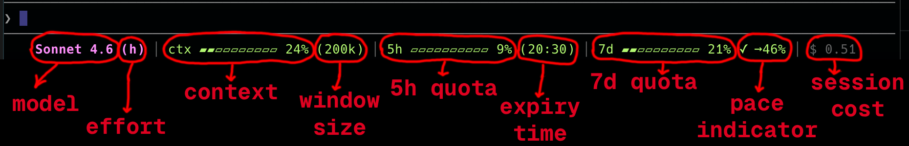
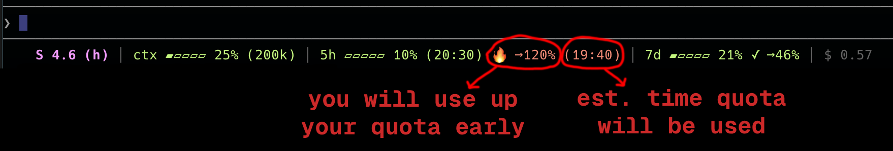

# claude_status_line

A status line renderer for [Claude Code](https://claude.ai/code). Reads the JSON object Claude Code passes to a `statusLine` command and writes a compact, colour-coded summary to stdout.

## What it shows

- **Model** and **effort level** (e.g. `Sonnet 4.6 (high)`)
- **Context window** usage with bar and token count
- **5-hour** and **7-day** rate limit usage with reset times
- **Pace indicator** — projects your current burn rate to end-of-window and warns when you're on track to exceed the limit
- **Session cost**

The output compresses automatically to fit any terminal width, shrinking bars and labels before dropping lower-priority fields.

## Examples

This shows most of the features. In this example you are on pace to use 46% of the weekly quota. 



Here we see usage has accelerated, and you will burn through the 5h quota by 19:40. Notice the progress bars have compressed, and the model name has shrunk from 'Sonnet 4.6' to 'S 4.6'.



Note also that the pace indidators only show once either 10% of the quota is used, or 10% of the time window has elapsed.

## Requirements

- [Rust](https://rustup.rs) (stable)
- [just](https://github.com/casey/just) (optional, for the convenience recipes)

## Installation

```sh
just install
```

Or without `just`:

```sh
cargo build --release
./target/release/claude_status_line --install
```

`--install` copies the binary to `~/.claude/statusline` and writes the `statusLine` key in `~/.claude/settings.json`. Re-run after building a new version to upgrade in place.

### Options

```
--install         Copy binary to ~/.claude/statusline and configure settings.json
-q, --quiet       Suppress output from --install
-h, --help        Show help
```

### CLAUDE_CONFIG_DIR

If the `CLAUDE_CONFIG_DIR` environment variable is set, `--install` uses that directory instead of `~/.claude`.

## Development

```sh
just lint        # clippy
just build       # debug build
just test        # run tests   
just build-release
```
